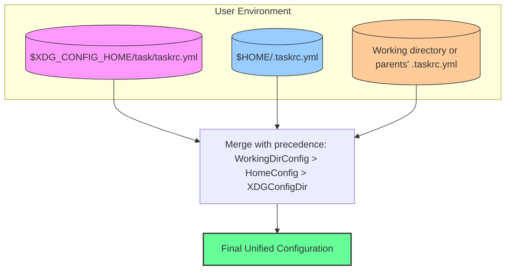

# Configuration and Taskrc Principles

Understand how Task manages its configuration through Taskrc files to control both global and project-specific behavior. This page explores how Task discovers multiple configuration files, the order in which they are applied, and how overrides are merged to provide a unified configuration tailored to your environment.

---

## Configuration File Discovery and Precedence

Task supports configuration through Taskrc files named `.taskrc.yml` or `.taskrc.yaml`. These files can be placed in multiple locations, with Task automatically discovering and merging them in a precise hierarchy to determine your final configuration.

### Locations Searched

Task searches for Taskrc files in the following locations, from the lowest priority to the highest:

1. **XDG Configuration Directory:** `$XDG_CONFIG_HOME/task` (usually `~/.config/task`)
   - Files here are named without the dot prefix: `taskrc.yml` or `taskrc.yaml`.
2. **User Home Directory:** `$HOME`
   - Files here are named `.taskrc.yml` or `.taskrc.yaml`.
3. **Project Directory and Parent Directories:**
   - Starting from the current working directory, Task searches upward through parent directories,
   including `$HOME` and root, for `.taskrc.yml` or `.taskrc.yaml`.

The closer a configuration file is to the current working directory, the higher its priority.

### Example Overlay

Consider these config files with their values:

```yaml [$XDG_CONFIG_HOME/task/taskrc.yml]
option_1: foo
option_2: foo
option_3: foo
```

```yaml [$HOME/.taskrc.yml]
option_1: bar
option_2: bar
```

```yaml [$HOME/path/to/project/.taskrc.yml]
option_1: baz
```

The resulting merged configuration will be:

```yaml
option_1: baz    # from $HOME/path/to/project/.taskrc.yml
option_2: bar    # from $HOME/.taskrc.yml
option_3: foo    # from $XDG_CONFIG_HOME/task/taskrc.yml
```

This layered merging ensures granular control with the ability to override behavior specifically per project while maintaining sane defaults at global levels.

---

## Configuration Loading and Merging

When Task starts, it loads Taskrc files in the above order, merging their settings into a single configuration object. The merging strategy is a deep overwrite:

- Settings in a higher priority file override any conflicting settings from a lower priority file.
- If a field is only set in one configuration file, it is simply included.

For example, if the project-level `.taskrc.yml` sets only `option_1`, while the home and XDG configs set other options, all options combine with `option_1` from the project taking precedence.

This merging process allows seamless extension and customization of Task’s behavior globally and on a per-project basis.

---

## Common Configuration Options

Your Taskrc files can configure various global behaviors. Here are notable options:

### `verbose`

- **Type:** boolean
- **Description:** Enables verbose output globally, useful for debugging Task’s internal processes.
- **Default:** `false`

```yaml
verbose: true
```

### `concurrency`

- **Type:** integer
- **Description:** Limits the number of concurrent tasks Task will run.
- **Default:** Not set (no explicit limit)

```yaml
concurrency: 4
```

### `experiments`

- **Type:** map of experiment flags
- **Description:** Enable experimental features by setting named flags to 1.

```yaml
experiments:
  REMOTE_TASKFILES: 1
  ENV_PRECEDENCE: 1
```

### `remote`

Configure behavior for remote Taskfiles:

| Option        | Type    | Description                                  |
|---------------|---------|----------------------------------------------|
| `insecure`    | boolean | Allow downloading Taskfiles over insecure connections. |
| `offline`     | boolean | Force use of local/cached Taskfiles only, no network. |
| `timeout`     | string  | Timeout duration for fetching remote Taskfiles (e.g. `30s`). |
| `cache-expiry`| string  | Duration before cached files expire (e.g., `24h`). |

```yaml
remote:
  insecure: false
  offline: false
  timeout: '30s'
  cache-expiry: '24h'
```

---

## How Task Finds and Applies Configuration

### 1. Load XDG Config

If `XDG_CONFIG_HOME` is set, Task attempts to load `taskrc.yml` or `taskrc.yaml` from `$XDG_CONFIG_HOME/task`.

### 2. Load Home Config

Task loads `.taskrc.yml` or `.taskrc.yaml` from `$HOME` if it exists and the working directory is not inside the home directory (to avoid duplication).

### 3. Load Local Project Config

Starting from the working directory, Task searches up the directory tree for `.taskrc.yml` or `.taskrc.yaml` files until `$HOME` or root is reached. If multiple are found, they are applied from highest to lowest in the hierarchy (closer to working dir has higher priority).

### 4. Merge Behavior

Each loaded config merges into the outgoing config with precedence to files found nearer to the working directory.

### 5. Result

After merging, the final unified config governs Task's behavior for that execution.

---

## Tips and Best Practices

- **Use local `.taskrc` for project-specific overrides:** Place `.taskrc.yml` files in your project root or subdirectories for per-project or per-subproject customizations.
- **Leverage `$XDG_CONFIG_HOME` for shared global config:** Set global defaults or experiment flags here that should apply across many projects.
- **Avoid conflicting option settings:** Higher-priority configs override lower, so be mindful of where you place global vs project overrides.
- **Version control your project-specific `.taskrc.yml` carefully:** Consider `.gitignore` if user-specific tweaks are included.
- **Debug with `verbose: true`:** Use the verbose setting globally or temporarily to troubleshoot Task’s configuration and execution.

---

## Troubleshooting

### Config Not Loading or Merging Properly

- Ensure your `.taskrc` files use supported names (`.taskrc.yml` or `.taskrc.yaml` for local/home; `taskrc.yml` or `taskrc.yaml` in XDG config).
- Confirm that the files are syntactically valid YAML.
- Use verbose mode (`--verbose` or `verbose: true`) to see which config files are loaded.

### Changes Not Being Picked Up

- Remember that config files in deeper directories override those above. Check if higher priority config files have the expected settings.
- Restart Task or your shell session if environment variables like `XDG_CONFIG_HOME` or `HOME` were recently changed.

---

## Related Documentation

- [Taskrc YAML Schema](https://github.com/clidey/task/blob/main/website/src/public/schema-taskrc.json) – For complete schema of available config options.
- [Configuration Reference](/reference/config/) – Deep dive into all config file options.
- [CLI Reference](/reference/cli/) – To override configs via CLI flags.
- [Experiments Documentation](/concepts/integration-extensions/feature-flags-and-experiments/) – Using feature flags in Taskrc.

---

## Diagram: Configuration File Discovery and Merging Process



This flowchart illustrates how Task merges configuration from the three sources, with the highest priority given to the working directory’s configuration.

---

By understanding these configuration and Taskrc principles, you gain full control over Task's environment and behavior, making your automation both powerful and flexible across different machines and projects.
