# Taskfile Structure and Data Models

Understanding the internal structure of a Taskfile is key to mastering Task's automation capabilities. This guide dives deep into how Taskfiles are represented, parsed, merged, and extended, revealing the schema behind tasks, dependencies, variables, and commands. With this knowledge, you can design sophisticated and maintainable automation workflows.

---

## Overview of the Taskfile Schema

At its core, a Taskfile is a YAML configuration that defines versioning, tasks, global variables, environment settings, included Taskfiles, and execution parameters. The schema evolves as a structured hierarchy allowing flexible yet explicit automation flows.

### Root-level Fields

- **version**: Defines the schema version (usually `3`) ensuring compatibility.
- **output**: Configures how parallel task outputs are displayed (interleaved, group, or prefixed).
- **method**: Default method (checksum, timestamp, none) to determine if tasks are up-to-date.
- **includes**: Maps namespaces to included Taskfiles, enabling modular workflows.
- **vars**: Global variables accessible to all tasks.
- **env**: Global environment variables applied to all tasks.
- **tasks**: The core set of task definitions.
- **silent**: Global flag to suppress output echoes by default.
- **dotenv**: List of `.env` files to load environment variables.
- **set** / **shopt**: Shell options affecting command execution.
- **run**, **interval**: Control task execution behavior and watch intervals.

Each of these contributes to building a versatile automation graph.

---

## Tasks: Definitions and Properties

Tasks are the automation units in a Taskfile. Each task specifies commands, dependencies, variables, and controls.

### Syntax Flexibility

Tasks support three ways to be defined:

- **Simple string**: A single command string.
- **Array of commands**: Runs commands in sequence.
- **Object form**: Full task configuration with metadata and properties.

### Key Task Properties

- **cmds / cmd**: One or more commands to execute.
- **deps**: List of dependent tasks running first (in parallel).
- **desc**: Short description for `task --list`.
- **summary**: Detailed description for `task --summary`.
- **prompt**: One or multiple prompts before execution.
- **aliases**: Alternate task names.
- **sources / generates**: Files to fingerprint for up-to-date checks.
- **status**: Custom shell checks to determine if task should skip.
- **preconditions**: Conditions that must be met before running; fail with clear messages if unmet.
- **requires**: Variables that must be set with optional allowed values (enforced prior to running).
- **silent**: Suppress command echo for this task.
- **internal**: Exclude task from CLI invocation and listing.
- **interactive**: Mark a task as running an interactive CLI.
- **platforms**: Restrict execution to certain GOOS/GOARCH values.
- **watch**: Enable automatic rerun on file changes.

### Dependencies and Looping

Dependencies (`deps`) can run tasks before the current one in parallel. These can include simple task names or complex for-loops that iterate over lists, matrices, variables, sources, or generates:

```yaml
tasks:
  build-all:
    deps:
      - for: [frontend, backend, worker]
        task: build
        vars:
          SERVICE: '{{.ITEM}}'
```

This enables dynamic concurrency and fine control over task invocation patterns.

---

## Variables and Environment

Variables in Taskfiles parameterize commands and tasks, providing dynamic and reusable automation.

### Variable Types

- **Static primitives**: strings, numbers, booleans, arrays.
- **Dynamic variables**: specified with `sh:` run as shell commands, output assigned to variable.
- **References**: using `ref:` to inherit or compute values from other variables.
- **Maps**: nested key-value structures with the `map:` keyword.

Global `vars` define variables usable everywhere; tasks can define local variables, which take precedence.

### Environment variables (`env`)

Separate from `vars`, `env` defines environment variables accessible during shell commands execution. Like `vars`, they support static values and dynamic shell commands.

### Variable Resolution Order

Task processes variables in this order for substitutions:

1. Task-local variables
2. Variables passed when calling the task
3. Variables of included Taskfiles
4. Variables of the including Taskfile
5. Global variables at the root
6. Environment variables

### Templating and Special Variables

Task uses Go's text/template syntax for interpolation, e.g., `{{.VARIABLE}}`. Special variables like `.TASK`, `.USER_WORKING_DIR`, and `.CLI_ARGS` are always available for templates.

---

## Command Representation

Commands within tasks can be strings or detailed objects allowing fine-tuned control:

- **cmd**: The shell command string.
- **silent**: Suppress echo for this command.
- **ignore_error**: Continue even if this command fails.
- **platforms**: Restrict execution by operating system and architecture.
- **set / shopt**: Shell options specific to this command.
- **task references**: Commands can be another task call with variable overrides and silent mode.
- **deferred commands**: Using `defer:` schedule commands or tasks to run after the main commands, even on failure.
- **loops**: The `for` property enables looping over lists, variables, matrices, etc., for both commands and dependencies.

Example looping over a list of names:

```yaml
cmds:
  - for: [alice, bob, charlie]
    cmd: echo "Hello {{.ITEM}}"
```

This brings powerful repetition and parameterization to automation.

---

## Includes and Composition

Taskfiles support composition through `includes`, allowing importing other Taskfiles into namespaces.

### Include Properties

- **taskfile**: Path or URL to the included Taskfile.
- **dir**: Working directory for included tasks.
- **optional**: Prevent errors if include is missing.
- **flatten**: Merge included tasks without namespace prefix.
- **internal**: Mark all included tasks as internal.
- **aliases**: Alternative namespace names.
- **excludes**: Exclude specific included tasks.
- **vars**: Override or pass variables to included Taskfile.
- **checksum**: Verify inclusion integrity.

Merging works carefully to avoid conflicts, and tasks from included files obey the root Taskfile's schema version.

---

## Taskfile Parsing and Merging

When Taskfiles are loaded, they are parsed into structured representations:

- The root Taskfile contains all configuration including version, output mode, and the tree of tasks.
- Included Taskfiles are recursively loaded and merged into the main Taskfile.
- Merging respects schema versions and ensures no forbidden features in includes (e.g., included files must not have `dotenv` keys).
- Variables and tasks are merged with proper namespace and variable scope handling.

This model enables maintainable and scalable automation setups.

---

## Example Taskfile Snippet

```yaml
version: '3'

vars:
  APP_NAME: myapp
  VERSION: 1.0.0

includes:
  backend:
    taskfile: ./backend/Taskfile.yml
    vars:
      SERVICE_NAME: backend

tasks:
  build:
    desc: Build the application
    deps: [init]
    cmds:
      - go build -o {{.APP_NAME}} ./...

  init:
    cmds:
      - echo "Initializing version {{.VERSION}}"
```

In this example, variables at global, inclusion, and task levels interact, with simple commands and dependencies.

---

## Best Practices and Tips

- Use `vars` and `env` intentionally to separate configuration from secrets.
- Leverage `includes` with `aliases` and `excludes` for modular Taskfiles.
- Use `requires` to enforce critical variables before running tasks.
- Define `sources` and `generates` to optimize task execution through fingerprinting.
- Use `preconditions` and `status` to control conditional execution and validity.
- Take advantage of looping in `cmds` and `deps` for batch operations and matrix builds.
- Use `silent` and `output` modes strategically to keep output readable.

---

## Troubleshooting Common Structure Issues

- Ensure the `version` field matches across included Taskfiles.
- Validate YAML indentation and syntax strictly.
- Avoid `.env` loading inside included Taskfiles (`dotenv` only at root).
- Check for conflicting task names when using `flatten` includes.
- When using `ref` variables, ensure referenced variables exist and are typed correctly.
- Validate platform-specific task execution restrictions.

---

## Upcoming: Diagram of Taskfile Schema Structure

```mermaid
graph TD
  TF["Taskfile"] --> Version["version"]
  TF --> Output["output"]
  TF --> Method["method"]
  TF --> Includes["includes"]
  TF --> Vars["vars (global)"]
  TF --> Env["env (global)"]
  TF --> Tasks["tasks"]
  TF --> Silent["silent"]
  TF --> Dotenv["dotenv"]
  TF --> Run["run"]
  TF --> Interval["interval"]

  Includes --> Include["Include"]
  Include --> TaskfilePath["taskfile"]
  Include --> Dir["dir"]
  Include --> Optional["optional"]
  Include --> Flatten["flatten"]
  Include --> Internal["internal"]
  Include --> Aliases["aliases"]
  Include --> Excludes["excludes"]
  Include --> VarsInc["vars"]
  Include --> Checksum["checksum"]

  Tasks --> Task["Task"]
  Task --> Cmds["cmds / cmd"]
  Task --> Deps["deps"]
  Task --> Desc["desc"]
  Task --> Prompt["prompt"]
  Task --> AliasesTask["aliases"]
  Task --> Sources["sources"]
  Task --> Generates["generates"]
  Task --> Status["status"]
  Task --> Preconditions["preconditions"]
  Task --> Requires["requires"]
  Task --> SilentTask["silent"]
  Task --> InternalTask["internal"]
  Task --> Platforms["platforms"]
  Task --> Watch["watch"]

  Cmds --> Command["Command"]
  Command --> CmdString["cmd"]
  Command --> SilentCmd["silent"]
  Command --> IgnoreError["ignore_error"]
  Command --> Set["set"]
  Command --> Shopt["shopt"]
  Command --> PlatformsCmd["platforms"]
  Command --> TaskRef["task"]
  Command --> Defer["defer"]
  Command --> For["for"]

  Deps --> DepTask["task"]
  Deps --> DepFor["for"]

  Requires --> VarsReq["vars"]

  Vars --> VarStatic["static"]
  Vars --> VarDynamic["sh"]
  Vars --> VarRef["ref"]
  Vars --> VarMap["map"]

  style TF fill:#f9f,stroke:#333,stroke-width:3px;
  style Tasks fill:#bbf,stroke:#333,stroke-width:2px;
  style Vars fill:#bfb,stroke:#333,stroke-width:2px;
  style Includes fill:#fbf,stroke:#333,stroke-width:2px;
  style Command fill:#ffb,stroke:#333,stroke-width:1px;
  style Deps fill:#bff,stroke:#333,stroke-width:1px;

```



This diagram maps the core components and properties of the Taskfile's schema, illustrating their relationships and how complex automation flows are modeled.

---

## Summary

This page uncovered the detailed schema of Taskfiles, explaining how tasks, variables, commands, dependencies, and includes are structured and interpreted internally. Understanding this schema empowers you to write effective, modular, and maintainable Taskfiles configured precisely to your automation needs.

By mastering Taskfile schema, you gain the ability to leverage Task's powerful features—conditional execution, up-to-date checks, dynamic variable referencing, looping constructs, and modular includes—to build robust automation pipelines.

---

## See Also

- [Taskfile Schema Reference](https://taskfile.dev/schema.json)
- [Variables and Environment Management Guide](/guides/advanced-features-patterns/variables-envs)
- [Managing Task Dependencies and Including Other Taskfiles](/guides/advanced-features-patterns/task-dependencies-includes)
- [Templating Reference](/docs/reference/templating)
- [Task Execution Lifecycle](/concepts/core-architecture/executor-flow)  

---