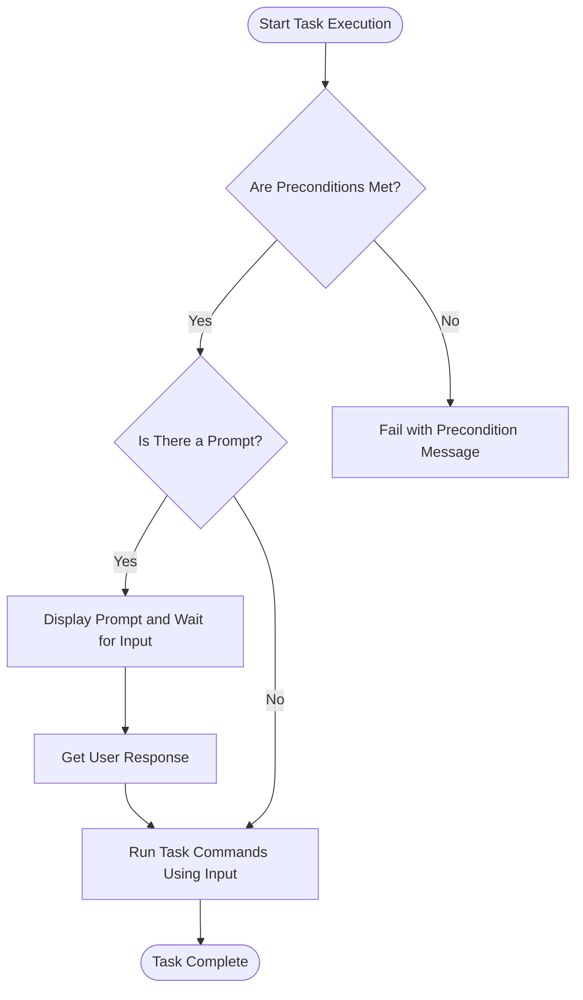

# Preconditions, Prompts, and Conditional Logic

Learn how to guard tasks with preconditions, prompt users for input, and enforce required variables or platform conditions. This empowers robust automation that is both safe and interactive when needed.

---

## Introduction

In everyday automation, you often want to run tasks only when certain conditions are met or require users to confirm or provide input before executing a command. This page teaches you how to use **preconditions** to safely guard your tasks, and **prompts** to interactively request information from users. Combined, these features increase the reliability, interactivity, and flexibility of your automation workflows.

Whether preventing destructive operations on the wrong branch, confirming environment readiness, or ensuring required variables are set, these mechanisms integrate seamlessly with Task’s execution model.

---

## Preconditions: Guarding Tasks with Safety Checks

### What Are Preconditions?

Preconditions are shell commands that must succeed before a Task runs. They act as gatekeepers, verifying that your environment, variables, or system state meet required criteria.

If any precondition fails, the task does not run, preventing potentially harmful or nonsensical operations.

### How Preconditions Work

- Preconditions are shell commands associated with a task.
- Before executing task commands, Task runs each precondition command.
- If a command exits with a failure status, the task halts.
- You can provide a custom failure message to explain why the task was blocked.

### Defining Preconditions in Your Taskfile

You can define a precondition succinctly as a command string or with an explicit shell command and message:

```yaml
tasks:
  deploy:
    preconditions:
      - test -f ./config.env                            # Simple precondition, default failure message
      - sh: '[ "$CI_BRANCH" = "main" ]'           # Shell snippet as precondition
        msg: "Deployment allowed only on 'main' branch"  # Custom failure message
    cmds:
      - echo "Deploying to production..."
```

### Practical Use Cases

- Verifying the presence of required files or environment variables.
- Ensuring the shell environment or platform matches expected values.
- Preventing tasks from running unintentionally on the wrong git branch or outside safe contexts.

### What Happens When Preconditions Fail

- Task immediately stops execution.
- The failure message from the precondition is displayed (default or custom).
- No commands within the task run.

This behavior strongly encourages safe automation by explicitly enforcing conditions before running potentially impactful commands.

### Best Practices

- Write clear, simple shell commands for preconditions.
- Use descriptive custom messages to communicate failure reasons effectively.
- Test preconditions separately to ensure they behave as expected.

### Common Pitfalls to Avoid

- Writing complex preconditions that might have side effects.
- Forgetting to quote shell expressions properly.
- Assuming preconditions run in the same environment as the commands (they do, but environment inheritance should be explicitly managed).

---

## Prompts: Interactive User Input for Dynamic Automation

### What Are Prompts?

Prompts pause task execution to request input or confirmation from users. They allow your automation to be interactive when necessary — for example, asking for a password, choosing an option, or confirming a sensitive action.

### How to Use Prompts

In your Taskfile, specify the `prompt` field as either a single string or a list of strings representing the messages:

```yaml
tasks:
  release:
    prompt: "Are you sure you want to release this version? (yes/no)"
    cmds:
      - echo "Releasing version..."
```

or

```yaml
tasks:
  build:
    prompt:
      - "Enter the target platform"
      - "e.g. linux/amd64 or darwin/arm64"
    cmds:
      - echo "Building for $@"
```

### What Happens During Prompting

- Task prints the prompt message(s) to standard output.
- Waits for user input on standard input.
- The input can be captured in variables for use in commands.

> Note: Prompt flexibility allows single or multiple lines to guide users clearly.

### Use Cases for Prompting

- Confirming destructive or critical actions.
- Collecting configuration parameters at runtime.
- Offering multi-step guidance with several prompt lines.

### Tips for Effective Prompting

- Keep prompts concise but instructive.
- Combine prompts with variables to dynamically inject user input into commands.
- Validate user input within your task commands as needed.

---

## Enforcing Required Variables and Platform Conditions

Task integrates preconditions and prompting naturally to implement more advanced conditional logic:

- **Requires:** You can pre-check certain variables or platform properties before running a task. If missing, fail explicitly.
- Use preconditions to run checks like "Is environment variable X set?" or "Is this platform Linux?"
- Combine with prompt to ask users to provide missing variables interactively.

This pattern avoids silent failures and guides users to satisfy conditions interactively when appropriate.

---

## Execution Flow: How Preconditions Fit Into Task Running

Here is the ideal flow when running a task that uses preconditions and prompts:



This flow ensures:
- Preconditions gate task execution early.
- Prompts enable dynamic user interaction where defined.
- Tasks run safely only once all conditions are met and/or input received.

---

## Troubleshooting Common Issues

<AccordionGroup title="Troubleshooting Preconditions and Prompts">
<Accordion title="Precondition Always Fails">
Check the shell command syntax in your precondition carefully. Try running it manually in the same environment as Task. Ensure variables used are exported or defined at runtime.
</Accordion>
<Accordion title="Custom Failure Message Not Displayed">
Make sure you define the `msg` field explicitly. If omitted, a default message based on the shell command is used.
</Accordion>
<Accordion title="Prompt Not Showing or Skipping Input">
Ensure your terminal allows interactive input for Task. Non-interactive CI environments will skip prompting.
</Accordion>
<Accordion title="Variables Not Set From Prompt Input">
Remember that prompt input needs to be captured and passed as variables appropriately in your task commands.
</Accordion>
</AccordionGroup>

---

## Summary

- Preconditions are simple, powerful shell commands that guard task execution.
- Prompts make automation interactive by requiring user input when needed.
- Combining these lets you build safer, dynamic workflows.
- Use clear messages and test preconditions separately to avoid surprises.

For a deep dive into related concepts, see the [Variables, Templating, and Inheritance](https://docs/task.com/concepts/execution-models/variables-templating) page to learn how to integrate prompt input effectively into your automation variables.

---

## References & Further Reading

- [Tasks and the Taskfile](/overview/core-concepts/tasks-and-taskfiles) — Understand how tasks fit in the system.
- [Variables and Environment Management](/guides/advanced-features-patterns/variables-envs) — Learn how to capture and use variables including prompted inputs.
- [Conditional Execution, Matrix Builds, and Loops](/guides/advanced-features-patterns/conditional-tasks-matrix-for) — Explore more automated conditional logic.
- [Task Execution Lifecycle](/concepts/core-architecture/executor-flow) — For insights on how Task processes conditions and commands.

---

## Example Taskfile Snippet

```yaml
tasks:
  secure-deploy:
    preconditions:
      - sh: '[ "$CI_BRANCH" = "main" ]'
        msg: "Deployment allowed only on the main branch"
      - sh: 'test -n "$DEPLOY_KEY"'
        msg: "DEPLOY_KEY variable must be set"
    prompt: "Confirm deploy to production? (yes/no)"
    cmds:
      - if [ "$@" != "yes" ]; then echo "Aborted"; exit 1; fi
      - ./deploy.sh
```

This task:
- Ensures it's running on the `main` branch.
- Ensures the `DEPLOY_KEY` variable is present.
- Prompts for explicit user confirmation before deploying.

---