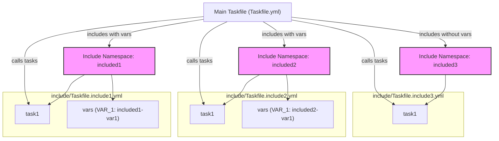

# Includes and Taskfile Composition

## Introduction

In complex automation workflows, breaking your project tasks into multiple, modular Taskfiles is essential for maintainability, reuse, and environment-specific logic. The *Includes* feature in Task enables you to compose your automation by including other Taskfiles seamlessly, supporting variable passing, namespacing, and merging strategies. This page guides you through understanding how to include Taskfiles, how Task merges them, and how variable scope and configuration are handled across includes.

---

## Why Use Includes?

Imagine having a large monorepo or multiple related projects where you want to centralize common build steps or testing setups. Instead of duplicating tasks in every project’s Taskfile, you create a shared Taskfile module and include it where needed. Includes enable:

- **Modularization:** Split tasks into logical units maintained separately.
- **Code Sharing:** Share common task definitions across multiple projects.
- **Environment Specificity:** Include different Taskfiles with tailored variables for environments like development, staging, and production.

This modular approach enhances clarity, reduces duplication, and accelerates automation development.

---

## How Includes Work

### Defining Includes

In your main `Taskfile.yml`, you use the `includes` mapping to declare one or more external Taskfiles to include. Each include entry has a namespace key and the associated details:

```yaml
includes:
  backend:
    taskfile: '../backend/Taskfile.yml'
  shared:
    taskfile: './shared-tasks.yml'
    vars:
      ENV: production
```

- **Namespace:** Acts as a prefix to tasks in the included Taskfile, preventing naming collisions.
- **Taskfile:** Path to the included Taskfile, can be relative or absolute.
- **Vars:** Optionally pass variables scoped only to the included Taskfile.

### Namespacing

By default, tasks from included Taskfiles are namespaced, requiring you to invoke them with the prefix. For example, if `backend:build` exists in included `backend` namespace, invoke with:

```bash
task backend:build
```

This makes task names unique and clear in composite workflows.

### Variable Passing

Variables can be passed into an include, overriding or extending the included Taskfile’s own variables. This allows environment-specific configurations or customization without editing the included Taskfile. For example:

```yaml
includes:
  shared:
    taskfile: './shared-tasks.yml'
    vars:
      LOG_LEVEL: debug
```

The included tasks will resolve `LOG_LEVEL` accordingly.

---

## Merging Strategies

Once Task loads the main Taskfile and its includes, it merges them into a unified model for execution. Here’s an overview of the merge process from the user perspective:

1. **Version Compatibility:** Included Taskfiles must match the main Taskfile's version.
2. **Variables and Environment:** Variables passed via `vars` are merged into included Taskfile variables, scoped properly.
3. **Tasks Union:** Tasks from all included Taskfiles merge under their namespace, or flattened if configured.
4. **Dotenv Restriction:** Included Taskfiles cannot declare dotenv files; the main file handles these.

This merging ensures consistent variable resolution, task discovery, and avoids side effects from internal includes.

---

## Practical Example

Here’s a concrete example demonstrating multiple includes with variable overrides and task calling:

```yaml
version: "3"

vars:
  GLOBAL_VAR: global-value

includes:
  included1:
    taskfile: include/Taskfile.include1.yml
    vars:
      VAR_1: included1-var1
  included2:
    taskfile: include/Taskfile.include2.yml
    vars:
      VAR_1: included2-var1
  included3:
    taskfile: include/Taskfile.include3.yml


tasks:
  task1:
    cmds:
      - task: included1:task1
      - task: included2:task1
      - task: included3:task1
```

- Each included Taskfile is loaded under its namespace (`included1`, `included2`, `included3`).
- The variable `VAR_1` is uniquely set per include.
- The `task1` command calls the `task1` task from each included Taskfile.

This setup modularizes task definitions and lets you customize variables per included scope.

---

## Variable Scope in Includes

Task handles variable scope thoughtfully to avoid unexpected overrides:

- **Global Variables:** Defined in the main Taskfile, accessible everywhere unless shadowed.
- **Include Vars:** Variables specified in an include entry override variables in that included Taskfile but are isolated to that scope.
- **Task-Specific Vars:** Variables can be defined per task or command; they override include and global vars.

This layered approach ensures clarity, predictable resolution, and flexibility for complex setups.

---

## Advanced Options

- **Flattening:** Optionally, you can flatten included tasks into the global namespace to avoid explicit prefixes. Use `flatten: true` in the include definition, but be cautious about task name collisions.
- **Aliases and Excludes:** Includes can define aliases for alternative names or exclude certain tasks to customize visibility.
- **Optional and Internal Flags:** Mark includes optional to prevent failures if missing; internal includes can hide tasks from user listing.

---

## Best Practices

- Use clear and consistent namespaces for included Taskfiles.
- Pass variables explicitly through `vars` to avoid implicit dependencies.
- Avoid flattening unless necessary – it can cause name collisions.
- Place shared/common includes in a dedicated directory or repository.
- Avoid declaring dotenv in included Taskfiles; keep environment config centralized.
- Use aliases sparingly to simplify task invocation but stay explicit.

---

## Common Pitfalls & Troubleshooting

<AccordionGroup title="Common Issues with Includes">
<Accordion title="Included Taskfile Version Mismatch">
If included Taskfiles have a different version than your main Taskfile, Task will return an error. Ensure all Taskfiles use the same `version`.
</Accordion>
<Accordion title="Dotenv Declaration Error">
You will see an error if an included Taskfile declares dotenv files. Move all dotenv declarations to the main Taskfile.
</Accordion>
<Accordion title="Variable Shadowing Unexpected Behavior">
If variables with the same name exist in multiple scopes, verify include `vars` overrides to prevent confusion. Define variables clearly and explicitly.
</Accordion>
<Accordion title="Task Name Collisions When Flattening">
Flattening includes merges all tasks without namespaces, which risks task name clashes. Avoid flatten or use unique task names.
</Accordion>
</AccordionGroup>

---

## Visualizing the Includes Architecture



This flowchart shows the main Taskfile including three external Taskfiles under separate namespaces with variable overrides for two.

---

## Summary

Includes and Taskfile composition enable you to build scalable, modular, and maintainable automation by including multiple Taskfiles with variable scope control and namespacing. By understanding merge behavior, variable hierarchy, and best practices, you can create sophisticated workflows that are easy to maintain and share.

For deeper exploration, refer to these related concepts:

- [Tasks and the Taskfile](https://docs.task.io/overview/core-concepts/tasks-and-taskfiles)
- [Variables and Environment Management](https://docs.task.io/overview/core-concepts/variables-and-environment)
- [Task Dependencies and Includes](https://docs.task.io/guides/advanced-features-patterns/task-dependencies-includes)
- [Taskfile Structure and Best Practices](https://docs.task.io/guides/getting-started-workflows/taskfile-structure-best-practices)

---

## Next Steps

- Explore the practical [Taskfile Structure and Best Practices](https://docs.task.io/guides/getting-started-workflows/taskfile-structure-best-practices) guide to organize includes effectively.
- Learn how to manage [Variables and Environment](https://docs.task.io/guides/advanced-features-patterns/variables-envs) across includes.
- Review examples of [Task Dependencies and Includes](https://docs.task.io/guides/advanced-features-patterns/task-dependencies-includes) for working with complex workflows.
- Use the [Task Execution Lifecycle](https://docs.task.io/concepts/core-architecture/executor-flow) to understand how includes fit into task execution.


---

## Source

<Source url="https://github.com/clidey/task" branch="main" paths={[{"path": "taskfile/ast/include.go", "range": "1-104"}, {"path": "taskfile/ast/taskfile.go", "range": "1-100"}]} />