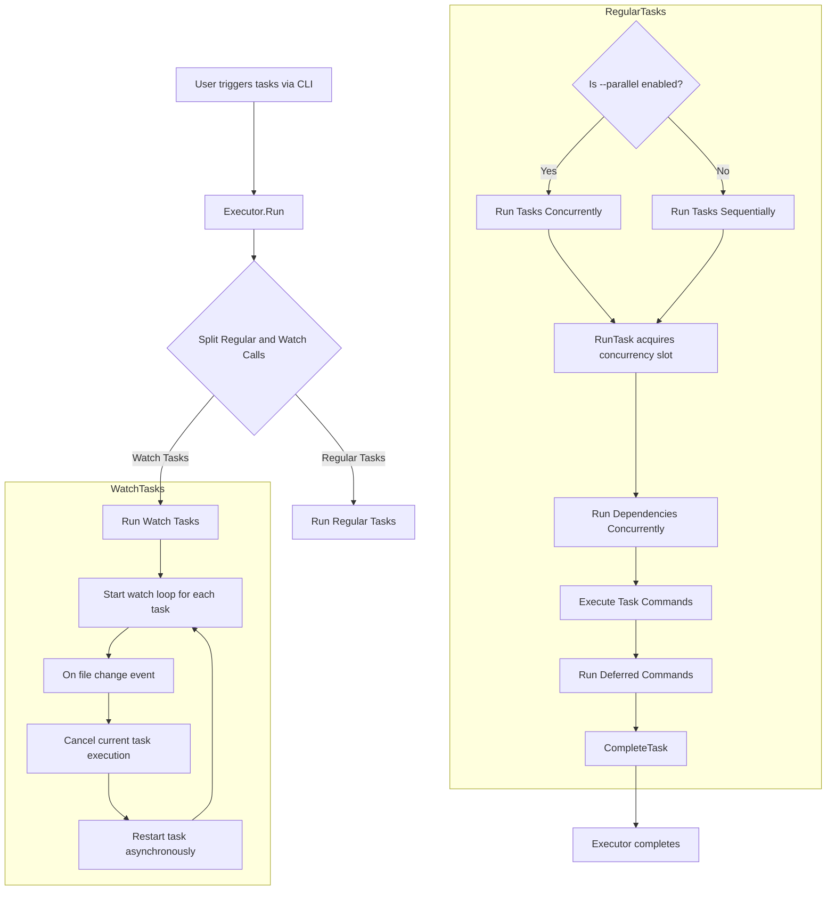

# Concurrency and Parallel Task Execution

Task empowers users to boost automation efficiency by running tasks concurrently while carefully managing dependency order and resource constraints. This guide dives into how Task handles concurrency internally and how you, as a user, can control parallelism to maximize throughput, avoid race conditions, and gracefully manage task dependencies.

---

## Understanding Parallel Task Execution in Task

When executing multiple tasks, improving performance through parallelism is essential, especially for independent or loosely coupled tasks. Task supports this by allowing tasks to run in parallel while honoring their dependencies and execution constraints.

### The User's Perspective: Goals and Controls

Your intention when using concurrency is to:

- **Accelerate workflow execution** by running unrelated tasks simultaneously.
- **Respect task dependencies,** ensuring dependent tasks run only after their prerequisites.
- **Manage system resource usage** to avoid overwhelming your machine.

Task exposes controls such as the `--parallel` flag and concurrency limits to tailor execution to these needs.

---

## Key Concepts

### 1. Parallel Execution Flag

The `--parallel` (or `-p`) flag tells Task to execute multiple called tasks concurrently where possible. By default, Task executes tasks sequentially to preserve order and reduce complexity.

### 2. Concurrency Limit

To prevent resource exhaustion, Task allows you to specify concurrency limits. This governs the maximum number of tasks that can run at the same time, balancing speed and stability.

Under the hood, Task uses a semaphore-like mechanism to control concurrent task executions.

### 3. Dependency-Aware Concurrency

Even when running tasks in parallel, Task carefully manages dependencies. Each task's dependencies are executed and completed before the task itself runs, regardless of the parallelism flag.

Dependency tasks themselves can run concurrently when independent.

### 4. Deferred Commands

Task supports deferred commands (`defer:`) that run after the main commands finish, useful for cleanup. These commands respect concurrency limits and task execution order to avoid conflicts.

### 5. Watching Tasks in Parallel

When using watch mode, multiple tasks with `watch: true` run concurrently, each triggered upon file system changes. Task controls this execution using the same concurrency and dependency mechanisms.

---

## How Task Executes Tasks in Parallel

### Execution Flow

1. **Task Validation:** Each requested task is validated to ensure it exists and is allowed.
2. **Task Splitting:** Tasks that require watching are separated from regular tasks.
3. **Concurrent Execution:** For regular tasks, if `--parallel` is enabled, tasks are launched as goroutines to proceed concurrently. Otherwise, they run sequentially.
4. **Dependency Execution:** Before running a task, its dependencies (`deps`) run concurrently with their own dependencies resolved first.
5. **Concurrency Control:** Before a task or dependency runs, it acquires a concurrency slot via a semaphore to enforce the maximum parallelism.
6. **Task Execution:** Command sequences within tasks run respecting platform constraints, preconditions, and fingerprint checks.
7. **Deferred Commands:** These run after main commands, honoring concurrency locks.
8. **Watching Watch-enabled Tasks:** After regular tasks complete, watch-enabled tasks enter their watch loop and run concurrently.

### Practical Implementation Highlights

- `Run(ctx, calls...)` accepts multiple tasks and coordinates parallel versus sequential execution based on `Parallel` flag.
- `RunTask(ctx, call)` acquires concurrency slots before running the task.
- Dependencies execute using an `errgroup`, allowing concurrent dependency resolution.
- A custom semaphore limits active concurrent tasks accounting for nested dependencies to prevent overwhelming.

---

## Managing Concurrency Limits

Task uses an internal semaphore: a buffered channel that controls how many tasks can run at once.

- If no concurrency setting is provided, all tasks can run unlimited concurrently.
- You can set concurrency via CLI flags or configuration to constrain resource usage.

### Example: Enabling Parallel Execution with Limit

```bash
# Run tasks foo, bar, baz in parallel with max 2 concurrent tasks
task --parallel --concurrency=2 foo bar baz
```

### Behind the Scenes Example

In code, acquiring a concurrency slot looks like:

```go
func (e *Executor) acquireConcurrencyLimit() func() {
  if e.concurrencySemaphore == nil {
    return emptyFunc
  }
  e.concurrencySemaphore <- struct{}{}
  return func() { <-e.concurrencySemaphore }
}
```

This pattern ensures that when a task starts, it occupies a concurrency slot, and when finished, releases it.

---

## Dependency Handling with Parallel Execution

Task employs advanced handling to respect dependencies:

- Dependencies of a task run using an `errgroup`, allowing them to execute concurrently but waiting for all to finish before the dependent task starts.
- This approach means that dependencies do not serialize unnecessarily.

### User Scenario

Consider three tasks:

- `build` depends on `compile` and `lint`
- `compile` and `lint` have no dependencies

With parallel enabled, `compile` and `lint` run at the same time. Only when they complete does `build` run.

This efficient task graph traversal maximizes processor usage while obeying task ordering.

---

## Real-World Execution Example

```yaml
version: '3'
tasks:
  lint:
    cmds:
      - echo "Linting code..."
  compile:
    cmds:
      - echo "Compiling source..."
  build:
    deps: [lint, compile]
    cmds:
      - echo "Building application..."
```

Run with parallel:

```bash
task --parallel build
```

Execution order:

1. `lint` and `compile` run concurrently.
2. Once both finish, `build` runs.

---

## Watching Tasks and Parallelism

When tasks are marked or invoked with watch mode (`watch: true` or `--watch` flag), Task starts watchers for each watched task concurrently.

When a file change triggers, Task cancels the current run and re-executes the task asynchronously.

This system uses the same concurrency and cancellation control ensuring resource limits and avoiding conflicts.

---

## Best Practices and Tips for Success

- **Set a reasonable concurrency limit** based on your system capabilities. Too high may flood resources, too low underutilizes CPU.
- **Use `--parallel` carefully** with tasks that modify shared resources to avoid race conditions.
- **Design dependencies comprehensively** to prevent deadlocks and ensure tasks run in correct order.
- **Leverage deferred commands (`defer:`)** for cleanup tasks ensuring they respect concurrency context.
- **Combine watch mode with concurrency** to efficiently rebuild or rerun tasks on file changes.

---

## Troubleshooting Common Issues

### Long-Running Tasks Blocking Others

If some tasks occupy all concurrency slots and run long, other tasks wait. Consider increasing the concurrency limit or redesigning tasks to run in smaller chunks.

### Deadlocks or Task Not Starting

Check dependency loops or cyclic dependencies. Task limits task calls to 1000 times to avoid infinite recursion.

### Tasks Seem Not to Run in Parallel

Verify `--parallel` is enabled and no concurrency limits inadvertently set too low.

### Errors Related to Resource Contention

Review tasks’ side effects and filesystem or network resource usage to avoid conflicts.

---

## Summary

Task's concurrency and parallel execution support enables powerful, efficient automation workflows. By blending concurrency control, dependency resolution, and cancellation management, Task empowers you to run multiple tasks simultaneously without sacrificing correctness or control.

Mastering these features unlocks faster CI pipelines, responsive watch workflows, and optimized resource utilization.

---

## Diagram: Task Execution and Concurrency Control



---

## Further Reading and References

- Explore [Task Execution Lifecycle](/concepts/core-architecture/executor-flow) for a detailed view of task invocation and management.
- Read about [Fingerprinting and Task Up-to-Date Checks](/concepts/robustness-and-performance/fingerprinting-up-to-date) to optimize redundant work skipping.
- Visit [Managing Task Dependencies](/guides/advanced-features-patterns/task-dependencies-includes) for building sophisticated workflows respecting dependency order.
- Consult [Output Management](/concepts/robustness-and-performance/output-management) to understand output behavior with concurrent tasks.

---

## Summary

This guide covered how Task executes tasks concurrently, balancing parallel execution with dependency order and concurrency limits.

Main sections covered:
- Parallel execution overview
- Concurrency limit controls
- Dependency-aware task running
- Deferred commands handling
- Watch mode concurrency
- Best practices and troubleshooting

Harness Task’s concurrency features to build fast, reliable automation pipelines tailored to your project needs.