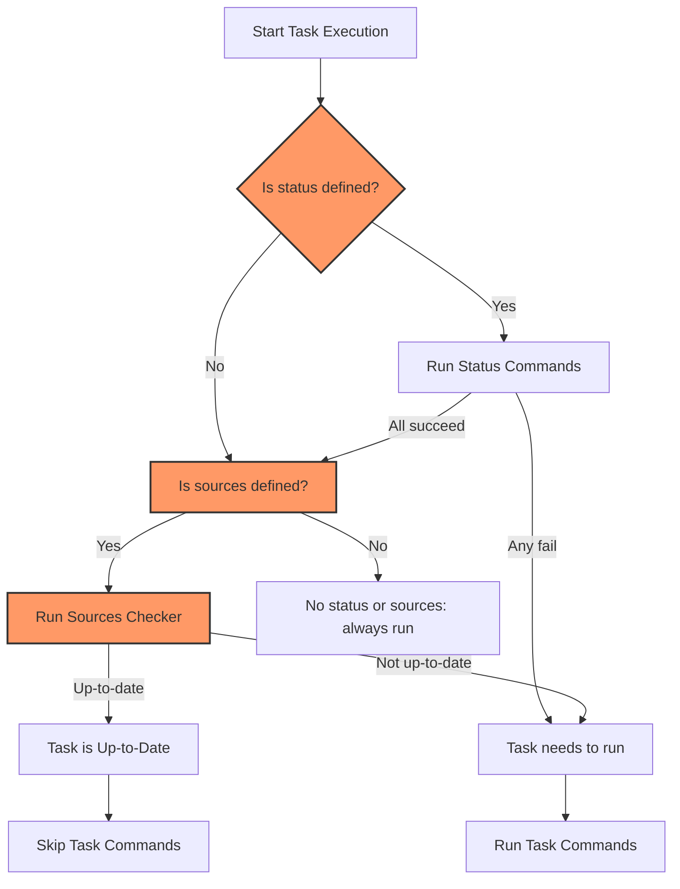

# Fingerprinting and Task Up-to-Date Checks

Task’s efficiency in automation hinges on knowing precisely when a task needs to run. Running tasks unnecessarily wastes time and resources, while skipping tasks that actually require execution risks build correctness. This page demystifies how Task determines whether tasks are "up-to-date" by combining status checks and source fingerprinting, including checksums and timestamps. Understanding these mechanisms empowers you to optimize incremental builds and customize task executions.

---

## Why Up-to-Date Checks Matter

When you run Task, it evaluates whether each task needs executing based on changes since the last run. This capability ensures that Task:

- Avoids redundant work, speeding up automation
- Preserves correctness by rerunning tasks with changed inputs
- Supports incremental builds for complex projects

Fingerprinting and status checks form the backbone of this functionality.


## Core Concepts: Status and Sources

**Tasks** describe automation units and can specify two key attributes for up-to-date checks:

- `status`: shell commands that return success when the task is up-to-date
- `sources`: files or globs whose changes dictate whether the task needs rerunning

Task combines these two signals intelligently:

| Status Set | Sources Set | Task is Up-to-Date?                 |
|------------|-------------|-----------------------------------|
| No         | No          | **No** — always rerun              |
| No         | Yes         | Yes, if sources unchanged          |
| Yes        | No          | Yes, if status commands succeed   |
| Yes        | Yes         | Yes, only if both status & sources are up-to-date |


### Status Checks

Status commands typically inspect external state or verify conditions to indicate task freshness. Task runs these commands and considers their exit status:

- Exit code 0: part of the task is considered up-to-date
- Non-zero exit codes: task is outdated and must rerun

For example, a status command might test if an artifact exists, or query a build tool’s state.


### Source Fingerprinting

Sources check whether files or directories relevant to the task have changed. Instead of naive timestamp checking, Task gives you options for robust fingerprinting:

- **Timestamp checking:** Compares modification times of source files against generated outputs.
- **Checksum checking:** Calculates a hash fingerprint of source contents for precise change detection.
- **None:** Disables source checking, forcing the task to always run.


## How Fingerprinting Works Internally

All fingerprinting implementations adhere to the `SourcesCheckable` interface, which includes:

- `IsUpToDate(t *Task)`: returns whether the source fingerprint indicates an up-to-date task
- `Value(t *Task)`: produces the current fingerprint value
- `OnError(t *Task)`: handles cleaning up state if checking fails
- `Kind()`: identifies the fingerprinting method (e.g., "timestamp", "checksum", "none")


### Checksum Checker

The checksum checker:

- Collects all source files matching the target globs
- Hashes both filenames and contents using the xxh3 hash
- Compares the current hash value with the previously recorded one
- Updates the saved checksum file only on successful runs (unless in dry mode)

This method catches any content changes, including file renames, ensuring exact detection.

```go
checksum := NewChecksumChecker(tempDir, dry)
isUpToDate, err := checksum.IsUpToDate(task)
```

If files listed in the task’s `generates` attribute are missing, it automatically flags the task as outdated.


### Timestamp Checker

The timestamp checker:

- Retrieves the latest modification time among all source files
- Retrieves the latest modification time among all generated files
- Compares these times; if any source is newer than all outputs, the task is outdated
- Uses a persistent "timestamp file" to track execution time

This method is faster than checksums but can miss changes if system clocks vary.


### None Checker

The none checker disables source-based fingerprinting and always returns outdated — ensuring the task always runs.


## Task Up-to-Date Decision Process

At runtime, Task applies a user-configurable method (default `none` or overridden by task or global `method` property) for sources checking. It also runs status checks if specified. The combined logic proceeds as follows:

1. Identify if status and/or sources checks are set.
2. For each enabled check, run the respective checker.
3. Combine results:
   - If both are set, task is up-to-date only if both are true.
   - If one is set, task is up-to-date if that one is true.
   - If none is set, the task is considered outdated and must run.


### Example User Workflow

Consider a task with sources and status:

- You modify a source file.
- On next run, checksum or timestamp checker detects the change.
- Task runs because sources changed.
- Status command may verify an external API state or output presence.
- If status check fails, task reruns regardless of sources.


## Practical Tips and Best Practices

- **Choose fingerprinting method wisely:** Use `checksum` for accuracy, `timestamp` for speed.
- **Always define `generates`:** Helps Task verify outputs exist and ensures correctness.
- **Use status commands for external dependencies:** If your task depends on external systems or conditions, status commands are essential.
- **Combine status and sources:** This provides robust, comprehensive detection.
- **Avoid over-reliance on timestamps:** Can fail with certain filesystem quirks or clock skew.
- **Clean fingerprints on failure:** Use `OnError` hooks to reset stale states.


## Troubleshooting Common Issues

<AccordionGroup title="Troubleshooting Fingerprinting">
<Accordion title="Task Always Runs Even When No Changes">
Check if fingerprint files are properly written. Confirm your `method` is set to `checksum` or `timestamp` and not `none`. Verify your sources and generates globs are correctly specified.
</Accordion>
<Accordion title="Tasks Not Running When They Should">
Ensure status commands fail when appropriate. Validate timestamps or checksums track all relevant input files. Remember clock skew can affect `timestamp` method.
</Accordion>
<Accordion title="Checksum Files Not Updated or Readable">
Check directory permissions for fingerprint storage (default `tempDir/checksum`). Dry mode disables writes.
</Accordion>
</AccordionGroup>


## How to Configure Fingerprinting in Your Taskfile

You can control fingerprinting via the task or global `method` field:

```yaml
tasks:
  build:
    method: checksum    # use checksum fingerprinting
    sources:
      - src/**
    generates:
      - bin/app
    status:
      - test -f bin/app
```

This instructs Task to use checksum fingerprinting and a status command that checks whether the output file exists before skipping the task.


## Fingerprinting in the Executor Lifecycle

When Task executes:

- It compiles the task and reads the desired method.
- It calls `IsTaskUpToDate` passing status and sources checker options.
- `IsTaskUpToDate` queries the status checker via shell commands and the sources checker via fingerprints.
- If the combined check returns false, Task runs the task commands.


## System Diagram of Fingerprinting Decision Flow




## Summary

Fingerprinting and status checking are integral to Task’s ability to perform reliable, incremental automation. By understanding and configuring these checks, you save time, avoid redundant execution, and maintain correctness across builds — all seamlessly integrated into Task’s workflow.

---

## Related Documentation

- [Tasks and the Taskfile](/overview/core-concepts/tasks-and-taskfiles): Understand task definitions and attributes
- [Task Execution Lifecycle](/concepts/core-architecture/executor-flow): See how fingerprinting fits into execution
- [Optimizing Task Performance](/guides/advanced-features-patterns/optimizing-performance): Advanced tips on fingerprinting and caching
- [Conditional Execution, Matrix Builds, and Loops](/guides/advanced-features-patterns/conditional-tasks-matrix-for): Use fingerprinting with conditional workflows

For CLI reference and configuration examples, visit the [Taskfile schema documentation](https://taskfile.dev/#/syntax).
