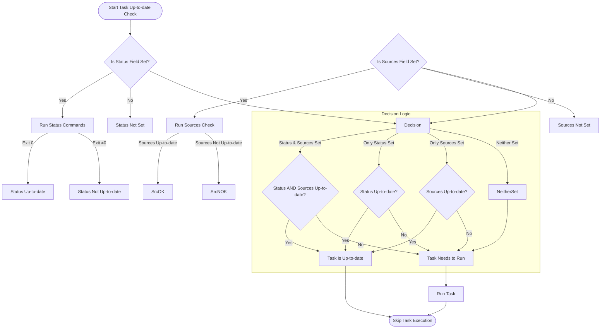

# Why Isn't My Task Running? Understanding Up-to-date Checks

Running automated tasks reliably is central to productivity with Task. Yet sometimes you may notice a task being skipped and wonder why — this usually comes down to Task determining whether a task is “up-to-date.” This guide unpacks how Task performs up-to-date checks, why tasks may be skipped, and practical advice for configuring or troubleshooting these behaviors.

---

## What Are Up-to-date Checks?

Up-to-date checks enable Task to determine if a task needs to run or can be skipped to save time. If Task detects that nothing has changed which requires the task to execute (e.g., source files are unchanged, outputs are present), the task is considered up-to-date and will be skipped.

This behavior makes your automation efficient, avoiding redundant executions and speeding up workflows.


## How Task Determines If a Task Is Up-to-date

Task combines two primary mechanisms for up-to-date checks — **Status Checks** and **Source Checks** — to make the decision.

### 1. Status Checks

Status checks run one or more commands configured in the task’s `status` field. If all status commands execute successfully (exit code zero), the task is considered up-to-date.

**Use case:** This can verify conditions such as whether certain services are running, files exist, or more complex logic controlled externally.

*Example:* A status command might check if a Docker container is running before skipping image build.

### 2. Source Checks

Source checks verify if the input files (`sources`) have changed. Task supports multiple methods:

- **Timestamp Method:** Compares file modification times of source and generated files.
- **Checksum Method:** Computes checksums (hashes) of source files and compares with previously stored checksum.
- **None:** Disables source checking (forces execution).

Additionally, Task validates that generated files (`generates`) exist and are not missing.


### Combining Status and Source Checks

| Status Set? | Sources Set? | Task is Up-to-date if...           |
|-------------|--------------|-----------------------------------|
| Yes         | Yes          | Both status and sources are OK    |
| Yes         | No           | Status is OK                      |
| No          | Yes          | Sources are OK                    |
| No          | No           | Task always runs (not up-to-date) |


## Why Is My Task Not Running?

Here are the common reasons a task is skipped due to up-to-date checks:

- **No Sources or Status Fields Defined:** If neither `sources` nor `status` are defined for the task, it is never considered up-to-date and will run every time.

- **Status Commands All Pass:** If you have status commands configured, but they return successful exit codes, Task considers the task up-to-date regardless of inputs.

- **Source Files Are Unchanged:** Using `timestamp` or `checksum` methods, Task detects no changes in source files relative to outputs, so it skips execution.

- **All Expected Output Files Exist:** If `generates` are defined, missing output files will cause the task to run; but if outputs exist and inputs are unchanged, the task is skipped.


## Practical Examples

### Defining Sources and Generates

```yaml
version: "3"
tasks:
  build:
    sources:
      - "src/**/*.go"
    generates:
      - "bin/app"
    cmds:
      - go build -o bin/app ./src
```

This configuration tells Task to run `build` only if `src/**/*.go` files have changed or if the generated file `bin/app` is missing.

### Using Status Checks

```yaml
version: "3"
tasks:
  deploy:
    status:
      - "kubectl rollout status deployment/myapp"
    cmds:
      - ./deploy.sh
```

Here, Task runs the status command to verify if the deployment is up-to-date. If `kubectl rollout status` is successful, the task is skipped.


## How to Configure Up-to-date Checking Method

You can specify the `method` in your Taskfile or per-task to control the source-check method.

```yaml
version: "3"
method: "checksum"  # global default

tasks:
  build:
    method: "timestamp" # overrides global
    sources:
      - "src/**/*.py"
```

Available methods:
- `timestamp` — checks modification times
- `checksum` — checks file contents
- `none` — disables source checking (task always runs)


## Troubleshooting and Tips

<AccordionGroup title="Common Causes for Unexpected Task Skipping">
<Accordion title="No Status or Sources Set">
If a task lacks both `status` and `sources` fields, it will never be considered up-to-date and will always run. This is expected behavior.
</Accordion>
<Accordion title="Status Commands Return Success Unexpectedly">
Verify your `status` commands are accurate. Successful exit code means Task marks that condition as met and skips the task.
Try running these commands manually to confirm.
</Accordion>
<Accordion title="Generates Files Missing or Renamed">
If the files declared in `generates` are absent or renamed, Task treats the task as out-of-date.
Ensure that `generates` paths accurately represent your outputs.
</Accordion>
<Accordion title="Method Not Set or Typo in Method Name">
Confirm you set a valid method (`timestamp`, `checksum`, `none`). Invalid methods cause errors or unexpected behavior.
</Accordion>
</AccordionGroup>


## Validating Up-to-date Logic

You can debug why Task skips or runs a task by:

- Running the task with verbose logging enabled (`-v` or `--verbose`).
- Manually checking file modification times (`ls -l`) or recomputing checksums.
- Confirming status commands' exit codes.


## Summary Diagram of Up-to-date Decision Flow




## Related Documentation

- [Fingerprinting and Task Up-to-Date Checks](https://docs.task.sh/concepts/robustness-and-performance/fingerprinting-up-to-date) — Deep dive into fingerprinting mechanisms.
- [Tasks and the Taskfile](https://docs.task.sh/overview/core-concepts/tasks-and-taskfiles) — Fundamentals of task definitions.
- [Task Execution Lifecycle](https://docs.task.sh/concepts/core-architecture/executor-flow) — How Task runs commands and resolves dependencies.
- [Troubleshooting Setup Issues](https://docs.task.sh/getting-started/first-usage-validation/troubleshooting-setup) — For installation and environment problems.


## Final Tips

- Always define either `status` or `sources` (or both) for tasks you want to skip intelligently.
- Choose the source checking `method` based on your project needs; `checksum` is more accurate but expensive, `timestamp` is faster.
- Use `generates` to ensure output presence validation.
- Run tasks with verbose output during debugging to see up-to-date evaluation logs.

---

Task’s up-to-date checks are the backbone for efficient automation. Mastering these concepts will empower you to write faster, smarter Taskfiles that run only when needed, saving developers time and building confidence in your automation setup.


---

*For any further questions or community support, visit [Getting Help & Community Support](/faq/integrations-support/getting-help).*