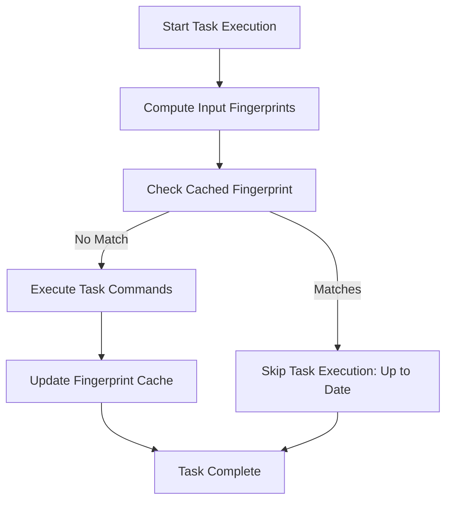

# Optimizing Task Performance: Fingerprinting and Caching

Task automates your workflows efficiently, but large or complex projects can slow down builds if not managed carefully. This guide focuses on using **fingerprinting**, **up-to-date checks**, and **caching** in Task to **speed up automation** by intelligently skipping redundant work.

---

## Understanding the Performance Challenge

Imagine you’re running a complex build or test suite where many commands execute. Without optimization, Task will rerun every task every time, even if nothing changed. This wastes time and resources.

Task solves this with smart checks to determine if a task's inputs have changed since the last run. If everything is unchanged, Task skips task execution, marking it as **"up to date"**.

---

## Core Concepts

### What is Fingerprinting?

Fingerprinting means generating a unique signature for a task’s inputs such as source files, environment variables, or command outputs.

- Task computes fingerprints by hashing these inputs.
- It compares fingerprints between runs to detect changes.
- If fingerprints match previous state, Task considers the task **up to date**.

### Up-to-date Checks

This is the process Task performs before executing a task:

- Compute fingerprints of relevant task sources.
- Check cached fingerprints from previous runs.
- If fingerprints match, skip task execution.

This incrementally avoids redundant work, dramatically speeding up builds.

### Caching Task Status

Task caches the status and fingerprints of each task run.

- Cache is automatically updated after successful task execution.
- Using the cache, Task can quickly determine if a task is current.
- You don’t need to manually handle caching; just configure fingerprinting inputs properly.

---

## When and Why to Use Fingerprinting and Caching

- **Long builds or tests:** Avoid rerunning unchanged parts.
- **Large projects:** Minimize unnecessary command executions.
- **CI/CD pipelines:** Reduce runtime and resource use.
- **Incremental workflows:** Only rebuild or retest what’s changed.

By applying fingerprinting and caching thoughtfully, you accelerate automation and increase productivity.

---

## How to Enable and Configure Fingerprinting in Your Taskfile

Follow these steps to set up effective fingerprinting for your tasks.

### Prerequisites

- Ensure your Taskfile defines tasks with meaningful input sources (files, variables).
- Use a recent version of Task that supports fingerprinting and up-to-date checks.

### Step 1: Define Inputs for Fingerprinting

Identify what changes should trigger reruns of your task, such as:

- Source files or directories
- Environment or Taskfile variables
- External data or generated files

Configure these inputs in your Taskfile using `sources` or other fingerprint-related fields.

#### Example:
```yaml
tasks:
  build:
    cmds:
      - go build ./...
    sources:
      - ./src/**
      - ./go.mod
```
This example fingerprints all files under `./src/` and the `go.mod` file to detect changes.

### Step 2: Review Task Output & Status Messages

When running `task build`, Task will indicate if the task was skipped due to being up to date:

```shell
task: Task "build" is up to date
```
This confirms fingerprinting and caching are actively preventing redundant work.

### Step 3: Combine With Dependencies

Use fingerprinting together with declared task dependencies. Task will consider all related sources before deciding whether to skip execution.

### Optional: Customize Fingerprint Behavior

You may want to control exact fingerprint inputs or exclude some temporary files using patterns.

Consult the [Taskfile schema reference](/reference/taskfile/) for advanced `sources` and fingerprinting options.

---

## Best Practices for Fingerprinting and Caching

- **Keep sources concise:** Include only files that actually impact task outcomes.
- **Avoid volatile files:** Exclude logs or cache directories to prevent false change detection.
- **Use variables carefully:** Fingerprint environment or Task variables that affect commands.
- **Test fingerprinting setups:** Run tasks repeatedly to confirm they skip correctly when unchanged.
- **Leverage includes and namespaces:** Manage modular Taskfiles while preserving correct fingerprint references.

---

## Troubleshooting Up-to-date Checks

<AccordionGroup title="Common Issues & Solutions">
<Accordion title="Task Always Re-runs Even When Files Are Unchanged">
Check that:

- `sources` are correctly defined and match the relevant files.
- No extraneous files or environment variables cause unintended fingerprint changes.
- The Taskfile version supports fingerprinting properly.

Try running with verbose logging (`task --verbose`) to debug what inputs Task is monitoring.
</Accordion>
<Accordion title="Task Is Skipped but Outputs Did Change">
Fingerprinting is based on inputs, not outputs.

- Ensure that all files or variables that influence the output are included as sources.
- If outputs depend on generated files, you might need to adjust your sources or dependencies.

</Accordion>
<Accordion title="Fingerprint Cache Seems Stale or Corrupted">
Delete or reset your Task cache directory to force fresh fingerprint computation.

You can find the cache location in Task configuration or environment.
</Accordion>
</AccordionGroup>

---

## Summary Diagram of Fingerprinting Workflow



---

## Next Steps & Related Documentation

- Explore the [Tasks and Taskfiles](/overview/core-concepts/tasks-and-taskfiles) guide to understand task definitions.
- Learn about [Dependencies and Includes](/overview/core-concepts/dependencies-and-includes) to combine fingerprinting with complex workflows.
- Dive into [Variables and Environment Management](/guides/advanced-features-patterns/variables-envs) for dynamic fingerprint inputs.
- Consult the [Taskfile Schema Reference](/reference/taskfile/) for detailed configuration options.
- Review troubleshooting guides if you encounter performance or build correctness issues.

---

<Tip>
Optimizing Task performance with fingerprinting and caching transforms your automation from slow and repetitive into fast, efficient, and scalable. Invest time upfront to define accurate inputs, and reap the rewards of incremental builds.
</Tip>

<Check>
To verify your setup:
- Run your task twice without changes.
- Confirm the second run outputs "Task is up to date" and skips command execution.
- Adjust inputs if the task reruns unnecessarily.
</Check>
