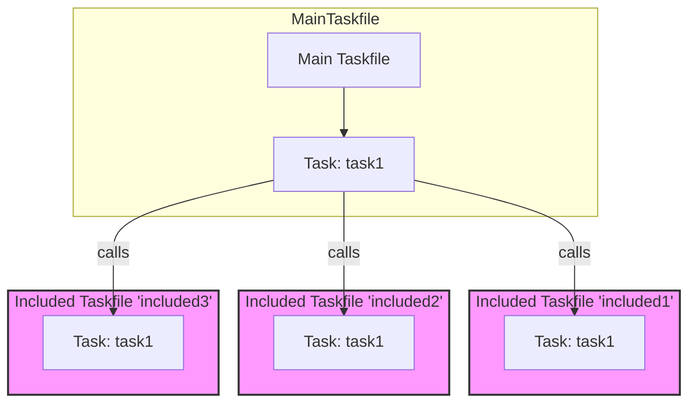

# Managing Task Dependencies and Including Other Taskfiles

Orchestrate complex workflows by setting up task dependencies and including Taskfiles from other modules, directories, or even remote sources. Learn how to keep Taskfiles DRY and scalable as your project grows.

---

## Workflow Overview

### What This Guide Helps You Achieve
This guide empowers you to structure complex automation by defining task dependencies within a Taskfile and by including other Taskfiles—whether local, remote, or modular. This approach streamlines your automation workflows, promotes code reuse, and keeps your Taskfiles maintainable as your projects expand.

### Prerequisites
- Installed Task CLI ([see installation guide](../getting-started/prerequisites-installation/installing-task))
- Familiarity with basic Taskfile syntax ([start here](../getting-started/initial-setup/setup-taskfile))
- At least one working Taskfile with simple tasks defined

### Expected Outcome
- Understand how to declare task dependencies so tasks run in the correct order
- Learn to include Taskfiles from other directories, modules, or remote URLs
- Learn variable passing and namespacing with includes
- Use includes to create modular, DRY Taskfiles

### Time Commitment
10-20 minutes depending on complexity of your workflow

### Difficulty Level
Intermediate – assumes basic knowledge of Taskfiles and command line

---

## Step-by-Step Instructions

### 1. Defining Task Dependencies Within a Taskfile

Tasks can depend on other tasks to ensure ordered execution.

#### How to set dependencies:
- Use the `deps` key under a task to mention dependent tasks by name.
- When you run the main task, dependencies execute first automatically.

#### Example:
```yaml
tasks:
  build:
    cmds:
      - echo Building the project

  test:
    deps:
      - build
    cmds:
      - echo Running tests
```

#### Expected behavior:
- Running `task test` runs `build` first, then `test` commands.

#### Verification:
Run:
```bash
task test
```
Expected output:
```
> echo Building the project
Building the project
> echo Running tests
Running tests
```

---

### 2. Including Other Taskfiles

Including other Taskfiles allows you to break your automation into smaller, reusable modules.

#### Include syntax:
Under the top-level `includes` key, define entries where:
- Key: Namespace to use for included tasks
- `taskfile`: Path or URL to the included Taskfile
- Optional keys: `vars`, `internal`, `aliases`, etc.

#### Basic local include example:
```yaml
includes:
  utils:
    taskfile: ./utils/Taskfile.yml

tasks:
  run-utils:
    cmds:
      - task: utils:clean
```

#### What happens:
- The Taskfile at `./utils/Taskfile.yml` is loaded under the namespace `utils`.
- You run its `clean` task by referencing `utils:clean`.

#### Passing variables to includes:
You can override or define variables scoped to the included Taskfile.
```yaml
includes:
  logger:
    taskfile: ./logger/Taskfile.yml
    vars:
      LOG_LEVEL: debug
```

#### Including remote Taskfiles:
You can include from HTTP URLs or Git repositories.
```yaml
includes:
  ci-pipeline:
    taskfile: https://example.com/common/ci/Taskfile.yml
    checksum: <checksum here>
    internal: true
```

> **Tip:** Always include a checksum for remote Taskfiles to ensure integrity and security.

#### Using `internal` flag:
Setting `internal: true` hides included tasks from direct CLI access, useful to avoid clutter or enforce encapsulation.

---

### 3. Leveraging Aliases and Excludes

Aliases allow referencing included Taskfiles with alternative namespace names.

Example:
```yaml
includes:
  dep1:
    taskfile: ./dependency/Taskfile.yml
    aliases:
      - dep1-alias
```

You can call tasks using either `dep1:taskname` or `dep1-alias:taskname`.

The `excludes` option lets you omit some tasks from being accessible when including.

---

### 4. Creating Composite Tasks that Reference Included Tasks

You can orchestrate included tasks to run in sequence.

Example:
```yaml
includes:
  mod1:
    taskfile: ./module1/Taskfile.yml
  mod2:
    taskfile: ./module2/Taskfile.yml

tasks:
  all:
    cmds:
      - task: mod1:build
      - task: mod2:test
```

Running `task all` triggers `mod1`'s `build` task followed by `mod2`'s `test` task.

#### Verification:
Run:
```bash
task all
```
Expected to see output from both included tasks running in the declared order.

---

### 5. Handling Common Pitfalls

- **Dotenvs Not Allowed Inside Included Taskfiles**: Included Taskfiles cannot contain `dotenv` declarations. Place these only in the top-level Taskfile.

- **Versioning Consistency**: Make sure all included Taskfiles use the same major version as the main Taskfile.

- **Use Namespaces When Including**: Avoid task name collisions by always calling included tasks with their namespace prefix.

- **Checksum Verification for Remote Includes**: Always specify checksums for remote Taskfiles to prevent unauthorized modifications.

- **Handling Optional Includes**: Use `optional: true` in includes to allow Task to continue if the included Taskfile is not found.

---

## Examples & Illustrations

### Example Taskfile with Multiple Includes and Variables

```yaml
version: "3"

vars:
  COMMON_VAR: global

includes:
  included1:
    taskfile: include/Taskfile.include1.yml
    vars:
      VAR_1: included1-var1
  included2:
    taskfile: include/Taskfile.include2.yml
    vars:
      VAR_1: included2-var1
  included3:
    taskfile: include/Taskfile.include3.yml


tasks:
  task1:
    cmds:
      - task: included1:task1
      - task: included2:task1
      - task: included3:task1
```

This setup defines three included Taskfiles, each with local variables. The composite task `task1` calls tasks from all included modules in sequence.

### Inclusion with Variable Interpolation

You can dynamically include Taskfiles using template variables:

```yaml
vars:
  MODULE_NAME: included

includes:
  include:
    taskfile: '../{{.MODULE_NAME}}/Taskfile.yml'
```

This allows flexible paths dependent on variable values.

---

## Troubleshooting & Tips

<AccordionGroup title="Common Issues When Including Taskfiles">
<Accordion title="Included Taskfile Containing Dotenv">
Included Taskfiles cannot have dotenv declarations. Move dotenv declarations to your main Taskfile to resolve this.
</Accordion>
<Accordion title="Checksum Mismatch for Remote Includes">
Verify the checksum hash matches the remote file. Regenerate or update the checksum after remote Taskfile updates.
</Accordion>
<Accordion title="Task Not Found Within Namespace">
Confirm the include namespace and task name are correct and prefixed properly with `namespace:task`.
</Accordion>
<Accordion title="Version Mismatch in Included Taskfiles">
Ensure the included Taskfile uses the same major version as your main Taskfile (usually `version: '3'`).
</Accordion>
</AccordionGroup>

<Tip>
Use the `internal: true` flag for included Taskfiles if you want to hide the included tasks from direct CLI invocation, making them accessible only through your own composite tasks.
</Tip>

<Tip>
Pass variables to included Taskfiles to customize behavior without duplicating code.
</Tip>

---

## Next Steps & Related Content

- Explore [Designing Clean and Maintainable Taskfiles](/guides/getting-started-workflows/taskfile-structure-best-practices) to organize complex Taskfiles with namespaces and aliases.
- Learn about [Task Dependencies in Depth](/overview/core-concepts/dependencies-and-includes) for advanced dependency management.
- Check out [Variables and Environment Management](/guides/advanced-features-patterns/variables-envs) to use variables effectively with includes.
- For pipeline integration, see [Integrating Task into CI/CD Pipelines](/guides/integrations-patterns/ci-cd-integration).

---

## Diagram: Taskfile Includes and Dependency Workflow



This diagram shows the main Taskfile including three namespaces, each with their own tasks, and how a main task runs tasks from included files sequentially.

---

## Summary

By mastering task dependencies and includes, you orchestrate scalable, modular automation workflows with Task. This lowers maintenance overhead, enables reuse, and creates robust automation across projects.

---