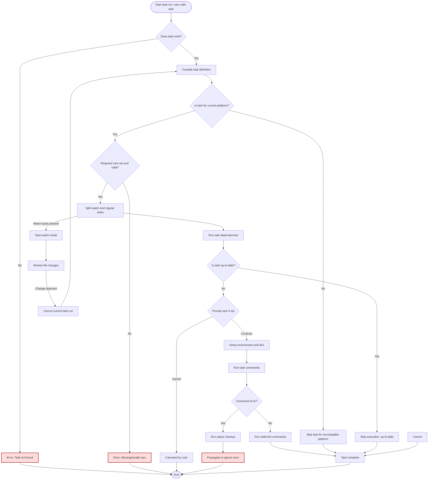

# Data Flow: From Taskfile to Execution

Discover how Task takes your Taskfile definitions and transforms them into executed commands through a series of well-orchestrated steps. This page unpacks the lifecycle of a command from initial parsing, through variable resolution, dependency management, up-to-date checks, command execution, and error handling — all grounded in a real-world user flow.

---

## Understanding What Happens When You Run a Task

Imagine you run the command:

```bash
task build
```

Behind the scenes, Task embarks on a multi-stage process to interpret your Taskfile, resolve variables, follow dependencies, and run your commands efficiently and safely. This section walks you through that journey, illustrating how Task ensures your automation runs smoothly and only when necessary.

### Step 1: Parsing and Compiling Tasks

When you invoke a task name, Task first locates and compiles the task definition:

- It looks up the task, accounting for aliases or wildcard matches.
- Variables specified at runtime or within the Taskfile are merged and resolved.
- The task is transformed into a compiled form ready for execution.

This compilation guarantees your task’s commands are fully known and that all prerequisites like directories and environments are prepared.

### Step 2: Checking Platform Compatibility

Before running anything, Task verifies if the task is meant to execute on your system's OS and architecture. Tasks can specify platforms they are compatible with to avoid running irrelevant commands on the wrong environment.

### Step 3: Evaluating Required Variables and Preconditions

Task enforces that all required variables are set and values are valid based on your Taskfile declarations. This fails fast if there's a missing or disallowed variable, preventing unexpected behavior.

Additionally, any preconditions defined on the task are checked to ensure it’s appropriate to proceed.

### Step 4: Splitting Regular and Watch Tasks

Tasks marked with `watch: true` trigger a different lifecycle:

- Task separates watch-enabled tasks from others.
- Regular tasks run normally, either in parallel or sequentially.
- Watch tasks start file watchers that restart the task automatically when source files change.

### Step 5: Running Dependencies First

Before executing your requested task’s commands, Task traverses its dependencies, recursively ensuring all dependent tasks are run and up-to-date.

This concurrency-aware traversal allows dependencies to run in parallel where possible, speeding up your workflows.

### Step 6: Fingerprinting and Up-to-Date Checks

To avoid unnecessary execution, Task employs methods such as checksum and timestamp fingerprinting to detect if a task’s sources or status have changed since the last run.

- If all checks pass and preconditions are met, Task skips running commands and reports the task as "up to date".
- Otherwise, it proceeds to execute the commands.


### Step 7: Prompting and Dry-Run Handling

If your task includes `prompt:` messages, Task pauses to ask for user confirmation before proceeding, respecting dry-run mode to avoid side effects during previews.

### Step 8: Setting Up the Execution Environment

Task ensures any specified output formatting, working directories, and environment variables are configured.

It also creates directories as needed to accommodate commands that write files or generate artifacts.

---

## Executing Commands and Handling Dependencies

### Running Commands

Commands within a task can be:

- Shell commands executed directly on your system.
- Calls to other tasks within the same Taskfile, which Task runs implicitly.

Commands marked with `defer: true` run once the main commands finish, useful for cleanup. Errors in deferred commands are logged but do not interrupt the overall workflow.

### Managing Platform-Specific Commands

Command blocks can specify platforms to run on. Task evaluates this to skip commands irrelevant to your current system configuration.

### Handling Errors and Status Updates

If a command fails:

- Task runs any error-specific status cleanup.
- It respects the `ignore_error` flag to optionally continue past failures.
- Errors propagate appropriately to stop the workflow or retry as needed.

### Up-to-Date Status Recalculation on Error

When a command fails, Task may clear cached fingerprints or status flags.

This ensures that a subsequent run won’t incorrectly skip tasks believed up-to-date.

---

## Advanced Case: Watch Mode Lifecycle

When a task or the CLI is run with `--watch`:

- Task initializes filesystem watchers on source directories, excluding ignored paths like `.git` or `node_modules`.
- On any relevant file change, the watcher cancels the running task and restarts it with fresh context.
- Directory watchers are refreshed periodically to catch newly created folders.
- Interrupt signals gracefully close watchers and terminate watch loops.

Watch mode enables responsive rebuilds or reruns during active development, maintaining efficient and accurate task execution.

---

## Visualizing Task Execution Flow

Below is a simplified flowchart illustrating the typical execution lifecycle for a Task:



---

## Practical Tips for Using Task Effectively

- **Use `watch: true` on tasks you want to rerun automatically on source changes.** This keeps your workflow interactive and efficient.
- **Define `sources:` and `generates:` carefully** so fingerprinting accurately detects changes.
- **Leverage `status:` commands to perform custom up-to-date checks** on external or remote build artifacts.
- **Use platform-specific conditions (`platforms:`)** to isolate commands to relevant environments, avoiding wasted runs.
- **Handle user prompts thoughtfully** to add safeguards for potentially destructive tasks.

---

## Troubleshooting Common Issues

<AccordionGroup title="Common Pitfalls and Solutions">
<Accordion title="Task Not Found or Alias Conflicts">
If a task call fails:
- Verify the task exists in your Taskfile or included files.
- Check if you used an alias or wildcard pattern ambiguously.
- Use the `task --list` command to confirm task names and aliases.
</Accordion>
<Accordion title="Tasks Unexpectedly Skipping Execution">
- Confirm your `sources:` and `generates:` are set properly and files exist.
- Remember tasks use fingerprinting methods (checksum or timestamp) to avoid reruns.
- Use `--force` or `--force-all` flags to bypass checks when debugging.
</Accordion>
<Accordion title="Watch Mode Not Triggering Rebuilds">
- Check ignored directories and files; `.git` and `node_modules` are excluded by default.
- Verify you have specified appropriate `sources:` in your tasks.
- Ensure watch intervals are reasonable to catch file events.
</Accordion>
<Accordion title="Command Errors Handling">
- Check if your commands require specific environment variables or directories.
- Review `ignore_error` settings if failures are unexpectedly halting.
- Inspect log output with `--verbose` for detailed error information.
</Accordion>
</AccordionGroup>

---

## Summary

This page illuminates the complete path from your Taskfile command invocation to the actual execution of work:

- Parsing and compiling task definitions
- Platform and variable validation
- Dependency resolution and concurrent execution
- Fingerprinting to optimize task execution
- Running commands with support for deferred cleanup
- Watching file changes to rerun tasks automatically
- Error recovery and logging

With an understanding of this flow, you can design Taskfiles that are efficient, maintainable, and responsive to your project’s changes.


---

## See Also

- [Tasks and the Taskfile](https://taskfile.dev/overview/core-concepts/tasks-and-taskfiles) — foundational understanding of Taskfile syntax
- [Variables and Environment Handling](https://taskfile.dev/overview/core-concepts/variables-and-environment) — learn how variable resolution integrates into task execution
- [Dependencies and Includes](https://taskfile.dev/overview/core-concepts/dependencies-and-includes) — managing complex workflows with dependencies
- [Fingerprinting and Task Up-to-Date Checks](https://taskfile.dev/concepts/robustness-and-performance/fingerprinting-up-to-date) — deeper dive into caching and execution optimization
- [Task Execution Lifecycle](https://taskfile.dev/concepts/core-architecture/executor-flow) — detailed architectural view

Explore these links to build mastery beyond the command execution flow.
