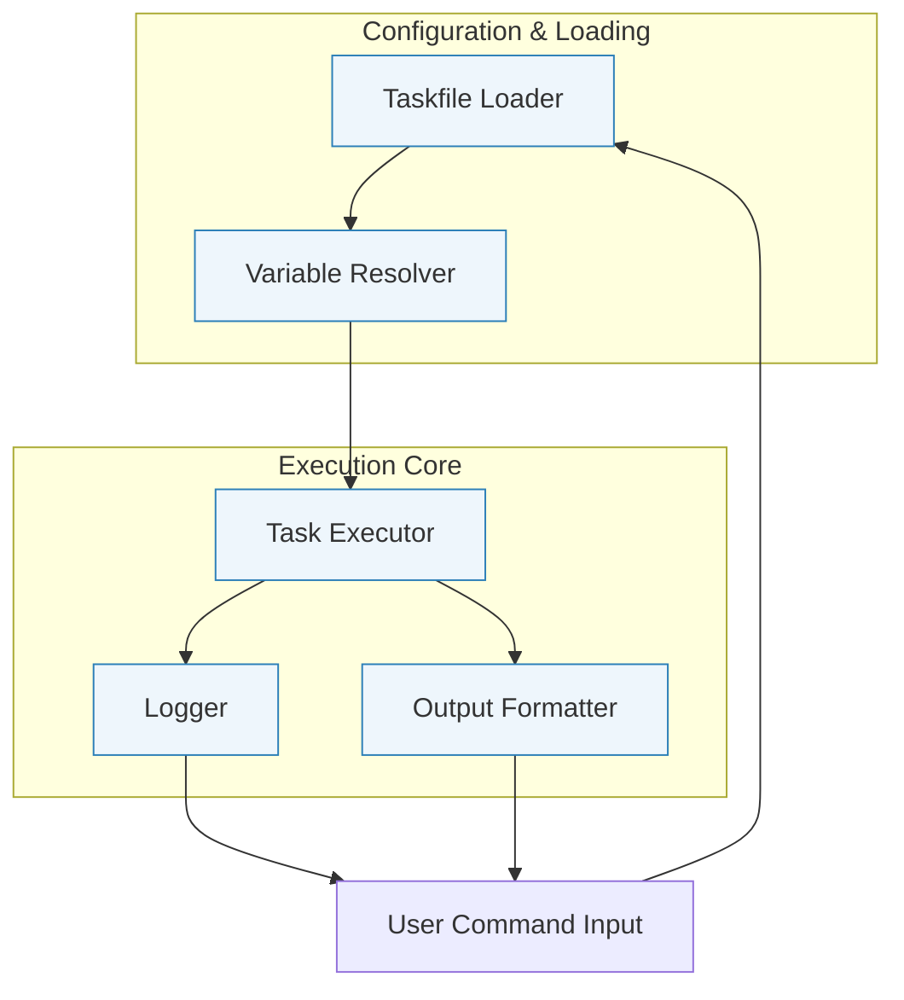

# Architecture Diagram

Experience Task's internal workings visually with this architecture diagram that clearly maps out its core components and how they collaborate to deliver efficient task automation.

## Why This Diagram Matters

Understanding the major components of Task helps you build accurate mental models and troubleshoot effectively. This architecture diagram situates you at the nexus of Taskfile loading, variable resolution, task execution, logging, and output formatting — so you know exactly how your automation commands flow through the system.

## Overview of Major Components

- **Taskfile Loader**: Responsible for reading and merging your main `Taskfile.yml` and any included Taskfiles into a unified configuration.

- **Variable Resolver**: Takes care of applying variable definitions, handling environment variables, templating expressions, and special variables to produce the final context for task execution.

- **Executor**: Handles orchestrating the execution of the defined tasks, managing dependencies, running commands, and ensuring platform-specific and conditional logic is respected.

- **Logger**: Captures runtime information and errors, providing detailed feedback to the user for command executions.

- **Output Formatter**: Controls how task output is presented, supporting different output modes such as interleaved, grouped, or prefixed to enhance readability.

## How It Works Together

When you run a task command, Task:

1. Loads your Taskfiles, merging included files to build a full task graph.
2. Resolves all variables, including static, dynamic (shell evaluated), and special built-in variables, applying templating logic.
3. Executes tasks in order, honoring dependencies and platform constraints.
4. Logs task progress and errors for immediate feedback.
5. Formats output according to your chosen output mode to help you quickly understand build logs.

This flow ensures your complex automation scripts execute predictably, efficiently, and clearly.

## Architecture Diagram

## Practical Implications

- Knowing the **Taskfile Loader** merges includes upfront helps you organize scripts modularly.

- Understanding the **Variable Resolver** means you can confidently use variables, shells scripts, and references.

- Seeing how the **Executor** orchestrates tasks reminds you that dependencies and platform restrictions are fully respected.

- Realizing the separation of **Logger** and **Output Formatter** clarifies how logs and outputs are cleanly managed for user readability.

## Tips for Success

- Structure your Taskfiles modularly, taking advantage of includes—it will simplify management as the loader merges them flawlessly.

- Use variables liberally for flexibility; the resolver handles complex templating and references.

- Leverage output modes (like grouping) to keep logs readable and to quickly find task results.

- If tasks don't run as expected, understand which component might be responsible (loading, resolution, execution, or output).

## Troubleshooting

- **Taskfile not loading included tasks**: Check file paths for includes; they are processed by the loader first.

- **Variables not resolving as expected**: Inspect the variable definitions and confirm templating syntax; the resolver does strict template evaluation.

- **Tasks skipping or running unexpectedly**: Verify dependencies and platform constraints in your Taskfile; the executor enforces these.

- **Unclear output logs**: Try changing the output mode in your Taskfile to `group` or `prefixed` for better clarity.

---

This diagram and overview give you a high-level map that demystifies Task's internal processes, empowering you to automate faster with clarity and confidence.

---

For more on how each component works in detail, explore:

- [Taskfile Structure and Data Models](/concepts/core-architecture/data-representations)
- [Variables, Templating, and Inheritance](/concepts/execution-models/variables-templating)
- [Task Execution Lifecycle](/concepts/core-architecture/executor-flow)
- [Includes and Taskfile Composition](/concepts/integration-extensions/includes-and-modularization)
- [Output Management and Logging](/concepts/robustness-and-performance/output-management)

To see how this architecture plays out in your own automation, start by building or exploring your own Taskfiles with actionable tasks and variables!
