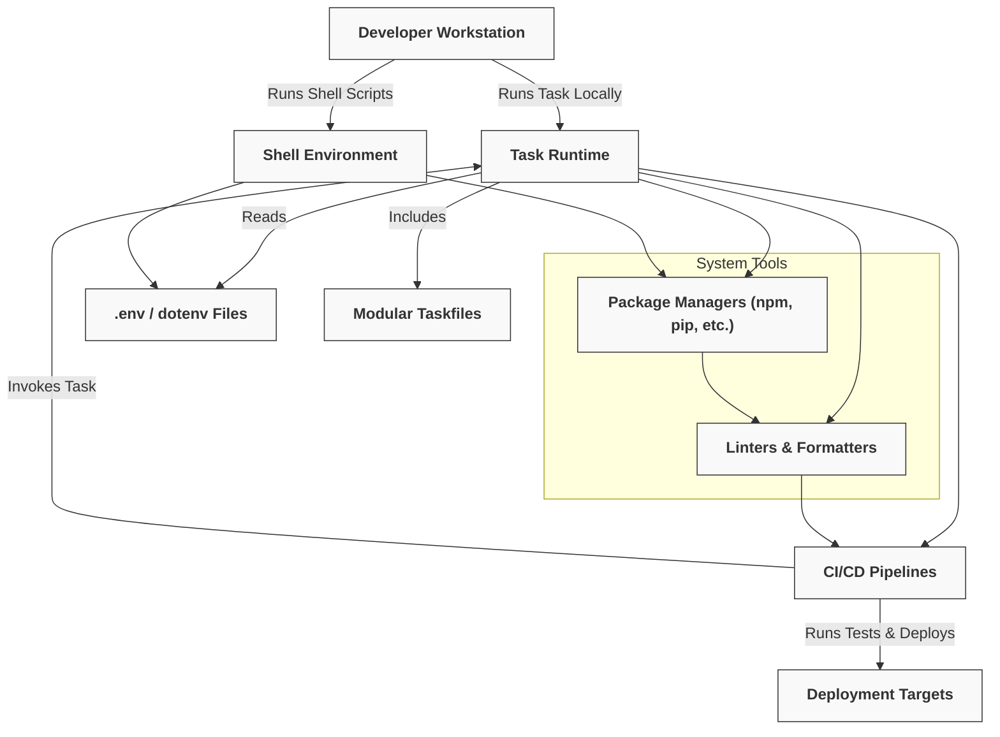

# Integration & Ecosystem

## Seamlessly Connect Task to Your Developer Toolchain

In today’s diverse development environments, your automation tool must not only work well on its own but also integrate smoothly with your existing tools and processes. The Integration & Ecosystem page is your gateway to understanding how Task complements and interoperates with other software development utilities, continuous integration pipelines, and scripting systems.

By exploring this page, you will learn how to embed Task into your workflows reliably and efficiently, ensuring a cohesive experience across your toolchain.

---

## What You Will Discover Here

This documentation focuses on the practical intersection points where Task interacts with other tools. Integration is about more than connecting two points; it’s about creating a fluid workflow that minimizes manual handoffs, avoids redundancy, and leverages each tool’s strengths.

Here’s what you can expect:

- **Key Integration Points:** How Task hooks into CI/CD pipelines, package managers, linters, and formatters.
- **Environment Compatibility:** Using Task alongside script shells and environment variable management to unify your scripts.
- **Best Practices:** Strategies for composing Taskfiles and configuring tasks so they play well with other automation.
- **Real-World Scenarios:** Practical examples showing Task powering builds, tests, and deployments within larger automation sequences.

---

## Why Integration Matters

Imagine a build pipeline where a single Taskfile orchestrates all your repetitive commands—from compiling code, running tests, formatting, to deployment scripting. Task’s flexibility and simplicity enable it to become the central automation hub within your ecosystem.

Without integration, teams juggle disconnected scripts and commands that fragment workflow, increase setup time, and introduce inconsistency. Integrating Task means:

- **Consistency Across Tools:** Ensure that task execution behaves the same, whether triggered locally or via CI.
- **Reduced Complexity:** Replace overlapping scripts and manual commands with declarative, reusable Taskfiles.
- **Ease of Maintenance:** Update a single Taskfile rather than multiple shell scripts or CI configurations.

---

## Core Integration Touchpoints

### 1. Continuous Integration Pipelines

Task is designed to slot directly into your CI processes — whether you use GitHub Actions, GitLab CI, Jenkins, Travis CI, or others:

- Run Task commands as part of your build or test jobs.
- Control concurrency and platform-specific task executions to optimize pipeline speed and reliability.
- Leverage Task’s robust variable and environment handling to pass configuration into CI jobs.

#### Example: Running a Task in a CI job
```yaml
jobs:
  build:
    runs-on: ubuntu-latest
    steps:
      - uses: actions/checkout@v3
      - name: Setup Task
        run: |
          curl -sL https://task.sh/install.sh | sh
      - name: Run Build Tasks
        run: task build
```

### 2. Package Managers, Linters, and Formatters

Task complements package managers like npm, yarn, or pip by handling project-agnostic or environment-specific automation steps:

- Run multiple linters and formatters in a single Task that simplifies `npm run lint`-style scripts.
- Chain commands that package managers typically don’t handle well, like file cleanup, environment prep, or artifact archiving.

### 3. Shell and Scripting Environments

Task integrates tightly with Unix-like shells and Windows Powershell/CMD:

- Uses familiar shell syntax within task commands, providing maximum flexibility.
- Supports environment variable propagation and dotenv files, harmonizing with existing shell scripts.

<Tip>
Use the `dotenv` option in Taskfiles to automatically load environment variables that your tooling depends on, creating consistent behavior across CLI and CI.
</Tip>

### 4. Modular Taskfile Composition

Complex projects often require modular automation:

- Use Task’s `includes` feature to incorporate Taskfiles from other repositories or directories.
- Share common automation logic across microservices or mono-repos without duplication.

---

## Practical Tips for Effective Integration

- **Align Environment Variable Usage:** Maintain consistent environment keys between Taskfiles and other tools to avoid confusion.
- **Use Namespaces for Includes:** When importing Taskfiles, namespace tasks to prevent name collisions.
- **Leverage Up-To-Date Checks:** Let Task skip unnecessary steps to optimize CI run times.
- **Document Integration Points:** Clearly comment in your Taskfiles how they fit into the wider toolchain.

<Warning>
Ensure external tools called by Task are installed and accessible in your CI environment or development machines to prevent failed runs.
</Warning>

---

## Troubleshooting Common Integration Issues

<AccordionGroup title="Common Integration Challenges">  
<Accordion title="Task commands fail in CI environment">  
Check that Task is installed in your CI runner and that needed PATHs are configured. Verify environment variables needed by Task are set or passed through your CI YAML.  
</Accordion>  
<Accordion title="Conflicting environment variables">  
Confirm variables set in the shell, dotenv, and Taskfile do not conflict. Use Task’s variable scoping to isolate task-specific values.  
</Accordion>  
<Accordion title="Unexpected task behavior when including multiple Taskfiles">  
Use namespaces when including Taskfiles to avoid task name collisions and unexpected overrides. Follow best practices for modular Taskfile composition.  
</Accordion>  
</AccordionGroup>

---

## Getting Started with Integration

To start integrating Task with your existing ecosystem:

1. Review your current automation: Identify repetitive shell commands or scripts suitable for Task.
2. Experiment running Task commands locally to ensure compatibility with your tools.
3. Incrementally introduce Task into your CI pipeline, test runs, or pre-commit hooks.
4. Leverage includes and modularization as automation needs grow.

Check out the following documentation for related deep dives:

- [Integrating Task into CI/CD Pipelines](../guides/integrations-patterns/ci-cd-integration)
- [Task with Other Tools (Package Managers, Linters, Formatters)](../guides/integrations-patterns/task-and-other-tools)
- [Community Patterns and Advanced Recipes](../guides/integrations-patterns/community-patterns)

---

## Summary

This page is your essential reference for making Task a natural part of your broader automation environment. By understanding integration points, best practices, and practical usage scenarios, you’ll unlock the full power of Task as a versatile, dependable automation backbone across your projects.


---

## Diagram: How Task Fits Into a Typical Developer Ecosystem



---

## Next Steps

Ready to take integration further?

- Explore the [CI/CD integration guide](../guides/integrations-patterns/ci-cd-integration) to see concrete pipeline examples.
- Learn about advanced Taskfile composition and modularity in [Includes and Dependencies](../overview/core-concepts/dependencies-and-includes).
- Deepen your understanding of environment variables and .env support in [Variables and Environment Handling](../overview/core-concepts/variables-and-environment).

These guides will empower you to create efficient, maintainable automation that fits flawlessly into your development and deployment workflow.


---